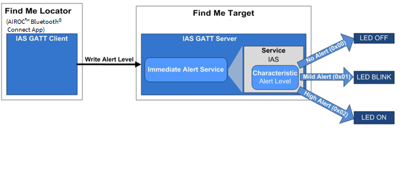

#  Bluetooth&reg; LE Find Me

This code example demonstrates the implementation of a simple Bluetooth® Immediate Alert Service (IAS)-based Find Me Profile (FMP) using AIROC™ Discrete Bluetooth® chips and ModusToolbox™ software environment.

[View this README on GitHub.](https://github.com/Infineon/mtb-example-btsdk-ble-findme)

[Provide feedback on this code example.](https://cypress.co1.qualtrics.com/jfe/form/SV_1NTns53sK2yiljn?Q_EED=eyJVbmlxdWUgRG9jIElkIjoiQ0UyMzU3MTYiLCJTcGVjIE51bWJlciI6IjAwMi0zNTcxNiIsIkRvYyBUaXRsZSI6IkJsdWV0b290aCZyZWc7IExFIEZpbmQgTWUiLCJyaWQiOiJhbW1sIiwiRG9jIHZlcnNpb24iOiIxLjAuMCIsIkRvYyBMYW5ndWFnZSI6IkVuZ2xpc2giLCJEb2MgRGl2aXNpb24iOiJNQ0QiLCJEb2MgQlUiOiJJQ1ciLCJEb2MgRmFtaWx5IjoiQlRBQkxFIn0=)

## Requirements

- [ModusToolbox&trade; software](https://www.infineon.com/cms/en/design-support/tools/sdk/modustoolbox-software/) v2.4 or later (tested with v2.4)
- Programming language: C
- Associated parts: 
[AIROC™ CYW20820 Bluetooth&reg; & Bluetooth&reg; LE system-on-chip](https://www.infineon.com/cms/en/product/wireless-connectivity/airoc-bluetooth-le-bluetooth-multiprotocol/cyw20820/), 
[AIROC™ CYW20819 Bluetooth&reg; & Bluetooth&reg; LE system-on-chip](https://www.infineon.com/cms/en/product/wireless-connectivity/airoc-bluetooth-le-bluetooth-multiprotocol/cyw20819/), 
[AIROC™ CYW20719 Bluetooth&reg; & Bluetooth&reg; LE system-on-chip](https://www.infineon.com/cms/en/product/wireless-connectivity/airoc-bluetooth-le-bluetooth-multiprotocol/cyw20719/), [AIROC™ CYW20835 Bluetooth&reg; & Bluetooth&reg; LE system-on-chip](https://www.infineon.com/cms/en/product/wireless-connectivity/airoc-bluetooth-le-bluetooth-multiprotocol/cyw20835/), [AIROC™ CYW20721 Bluetooth&reg; & Bluetooth&reg; LE system-on-chip](https://www.infineon.com/cms/en/product/wireless-connectivity/airoc-bluetooth-le-bluetooth-multiprotocol/cyw20721/)


## Supported toolchains (make variable 'TOOLCHAIN')

- GNU Arm® embedded compiler v10.3.1 (`GCC_ARM`) - Default value of `TOOLCHAIN`

## Supported kits (make variable 'TARGET')

- [CYW920820M2EVB-01 evaluation kit](https://www.infineon.com/cms/en/product/wireless-connectivity/airoc-bluetooth-le-bluetooth-multiprotocol/cyw20820/)(`CYW920820M2EVB-01`)- Default value of `TARGET`
- [CYW920819M2EVB-01 evaluation kit](https://www.infineon.com/cms/en/product/wireless-connectivity/airoc-bluetooth-le-bluetooth-multiprotocol/cyw20819/)(`CYW920819M2EVB-01`)
- [CYW989820M2EVB-01 evaluation kit](https://www.infineon.com/cms/en/product/wireless-connectivity/airoc-bluetooth-le-bluetooth-multiprotocol/cyw89820/)(`CYW989820M2EVB-01`)
- [CYW920835M2EVB-01 evaluation kit](https://www.infineon.com/cms/en/product/evaluation-boards/cyw920835m2evb-01/) (`CYW920835M2EVB-01`)
- [CYW920719B2Q40EVB-01 evaluation kit](https://www.infineon.com/cms/en/product/evaluation-boards/cyw920719b2q40evb-01/) (`CYW920719B2Q40EVB-01`)
- [CYW920721M2EVK-01 evaluation kit](https://www.infineon.com/cms/en/product/wireless-connectivity/airoc-bluetooth-le-bluetooth-multiprotocol/cyw20721/) (`CYW920721M2EVK-01`)
- [CYW920819EVB-02 evaluation kit](https://www.infineon.com/cms/en/product/evaluation-boards/cyw920819evb-02/) (`CYW920819EVB-02`)
- [CYW920820EVB-02 evaluation kit](https://www.infineon.com/cms/en/design-support/finder-selection-tools/product-finder/evaluation-board/) (`CYW920820EVB-02`)


## Hardware setup
This example uses the board's default configuration. See the kit user guide to ensure that the board is configured correctly.

## Software setup
This code example consists of two parts: a locator and a target.

For the locator, download and install the LightBlue® app for [iOS](https://apps.apple.com/us/app/lightblue/id557428110) or [Android](https://play.google.com/store/apps/details?id=com.punchthrough.lightblueexplorer&gl=US).

You can also use other Android or iOS apps that support the IAS service.

Scan the following QR codes from your mobile phone to download the LightBlue app.


## Using the code example

Create the project and open it using one of the following:

<details><summary><b>In Eclipse IDE for ModusToolbox&trade; software</b></summary>

1. Click the **New Application** link in the **Quick Panel** (or, use **File** > **New** > **ModusToolbox Application**). This launches the [Project Creator](https://www.infineon.com/dgdl/Infineon-ModusToolbox_Project_Creator_Guide_3-UserManual-v01_00-EN.pdf?fileId=8ac78c8c7d718a49017d99bcabbd31e5) tool.

2. Pick a kit supported by the code example from the list shown in the **Project Creator - Choose Board Support Package (BSP)** dialog.

   When you select a supported kit, the example is reconfigured automatically to work with the kit. To work with a different supported kit later, use the [Library Manager](https://www.infineon.com/dgdl/Infineon-ModusToolbox_Library_Manager_User_Guide_3-UserManual-v01_00-EN.pdf?fileId=8ac78c8c7d718a49017d99ab34b831ce) to choose the BSP for the supported kit. You can use the Library Manager to select or update the BSP and firmware libraries used in this application. To access the Library Manager, click the link from the **Quick Panel**.

   You can also just start the application creation process again and select a different kit.

   If you want to use the application for a kit not listed here, you may need to update the source files. If the kit does not have the required resources, the application may not work.

3. In the **Project Creator - Select Application** dialog, choose the example by enabling the checkbox.

4. Optionally, change the suggested **New Application Name**.

5. The **Application(s) Root Path** defaults to the Eclipse workspace which is usually the desired location for the application. If you want to store the application in a different location, you can change the *Application(s) Root Path* value. Applications that share libraries should be in the same root path.

6. Click **Create** to complete the application creation process.

For more details, see the [Eclipse IDE for ModusToolbox&trade; software user guide](https://www.infineon.com/dgdl/Infineon-Eclipse_IDE_for_ModusToolbox_User_Guide_1-UserManual-v01_00-EN.pdf?fileId=8ac78c8c7d718a49017d99bcb86331e8) (locally available at *{ModusToolbox&trade; software install directory}/ide_{version}/docs/mt_ide_user_guide.pdf*).

</details>

<details><summary><b>In command-line interface (CLI)</b></summary>

ModusToolbox&trade; software provides the Project Creator as both a GUI tool and a command line tool, "project-creator-cli". The CLI tool can be used to create applications from a CLI terminal or from within batch files or shell scripts. This tool is available in the *{ModusToolbox&trade; software install directory}/tools_{version}/project-creator/* directory.

Use a CLI terminal to invoke the "project-creator-cli" tool. On Windows, use the command line "modus-shell" program provided in the ModusToolbox&trade; software installation instead of a standard Windows command-line application. This shell provides access to all ModusToolbox&trade; software tools. You can access it by typing `modus-shell` in the search box in the Windows menu. In Linux and macOS, you can use any terminal application.

The following table lists the arguments for this tool:

Argument | Description | Required/optional
---------|-------------|-----------
`--board-id` | Defined in the `<id>` field of the [BSP](https://github.com/cypresssemiconductorco?q=bsp-manifest&type=&language=&sort=) manifest | Required
`--app-id`   | Defined in the `<id>` field of the [CE](https://github.com/cypresssemiconductorco?q=ce-manifest&type=&language=&sort=) manifest | Required
`--target-dir`| Specify the directory in which the application is to be created if you prefer not to use the default current working directory | Optional
`--user-app-name`| Specify the name of the application if you prefer to have a name other than the example's default name | Optional


The following example will clone the "[Bluetooth® LE Find Me](https://devops-git.aus.cypress.com/wpp/ce/mtb/mtb-example-btsdk-ble-findme)" application with the desired name "LE_Find_Me" configured for the *CYW920820M2EVB-01* BSP into the specified working directory, *C:/mtb_projects*:

   ```
   project-creator-cli --board-id CYW920820M2EVB-01 --app-id mtb-example-btsdk-ble-findme --user-app-name LE_Find_Me --target-dir "C:/mtb_projects"
   ```

**Note:** The project-creator-cli tool uses the `git clone` and `make getlibs` commands to fetch the repository and import the required libraries. For details, see the "Project creator tools" section of the [ModusToolbox&trade; software user guide](https://www.infineon.com/dgdl/Infineon-ModusToolbox_2.4_User_Guide-Software-v01_00-EN.pdf?fileId=8ac78c8c7e7124d1017ed97e72563632) (locally available at *{ModusToolbox&trade; software install directory}/docs_{version}/mtb_user_guide.pdf*).


</details>

<details><summary><b>In third-party IDEs</b></summary>

Use one of the following options:

- **Use the standalone [Project Creator](https://www.infineon.com/dgdl/Infineon-ModusToolbox_Project_Creator_Guide_3-UserManual-v01_00-EN.pdf?fileId=8ac78c8c7d718a49017d99bcabbd31e5) tool:**

   1. Launch Project Creator from the Windows Start menu or from *{ModusToolbox&trade; software install directory}/tools_{version}/project-creator/project-creator.exe*.

   2. In the initial **Choose Board Support Package** screen, select the BSP and click **Next**.

   3. In the **Select Application** screen, select the appropriate IDE from the **Target IDE** drop-down menu.

   4. Click **Create** and follow the instructions printed in the bottom pane to import or open the exported project in the respective IDE.

- **Use command-line interface (CLI):**

   1. Follow the instructions from the **In command-line interface (CLI)** section to create the application, and import the libraries using the `make getlibs` command.

   2. Export the application to a supported IDE using the `make <ide>` command.

   3. Follow the instructions displayed in the terminal to create or import the application as an IDE project.

For a list of supported IDEs and more details, see the "Exporting to IDEs" section of the [ModusToolbox&trade; software user guide](https://www.infineon.com/dgdl/Infineon-ModusToolbox_2.4_User_Guide-Software-v01_00-EN.pdf?fileId=8ac78c8c7e7124d1017ed97e72563632) (locally available at *{ModusToolbox&trade; software install directory}/docs_{version}/mtb_user_guide.pdf*).

</details>

## Operation
1. Connect the board to your PC using the provided USB cable through the KitProg3 USB connector.

2. Use your favorite serial terminal application and connect to the KitProg3 COM port. Configure the terminal application to access the serial port using the following settings:

   Baud rate: 115200 bps; Data: 8 bits; Parity: None; stop: 1 bit; Flow control: None; New line for receive data: Line Feed(LF) or auto setting

3. Program the board using one of the following:

   <details><summary><b>Using Eclipse IDE for ModusToolbox&trade; software</b></summary>

      1. Select the application project in the Project Explorer.
      2. In the **Quick Panel**, scroll down, and click **\<Application Name> Program (KitProg3_MiniProg4)**.

         **Figure 1. Quick panel**

         

   </details>

   <details><summary><b>Using CLI</b></summary>

     From the terminal, execute the `make program` command to build and program the application using the default toolchain to the default target. The default toolchain and target are specified in the application's Makefile but you can override those values manually:
      ```
      make program TARGET=<BSP> TOOLCHAIN=<toolchain>
      ```

      Example:
      ```
      make program TARGET=CYW920820M2EVB-01 TOOLCHAIN=GCC_ARM
      ```
   </details>

   **Note**: Before building the application, ensure that the *deps* folder contains the BSP file (*TARGET_xxx.lib*) corresponding to the TARGET. Execute the `make getlibs` command to fetch the BSP contents before building the application.

4.	To test using the LightBlue mobile app, do the following (see equivalent LightBlue app screenshots in [Figure 2](#figure-2-testing-with-the-LightBlue-app-on-ios) and [Figure 3](#figure-3-testing-with-the-LightBlue-app-on-android)):

    1. Turn ON Bluetooth&reg; on your Android or iOS device.

    2. Launch the LightBlue app.

    3. Press the reset switch on the CYW920820M2EVB-01 kit to start sending advertisements. The yellow LED (LED1) starts blinking to indicate that advertising has started. Advertising will stop after 90 seconds if a connection has not been established.

    4. Swipe down on the LightBlue app home screen to start scanning for BLE peripherals; your device (“Find Me Target”) appears in the LightBlue app home screen. Select your device to establish a BLE connection. Once the connection is established, the yellow LED (LED1) changes from blinking state to always ON state.

    5. Select the 'Alert level' Option.

    6. Select an alert level value on the Find Me Profile screen. Observe the state of the red LED (LED2) on the device changes based on the alert level.

         [Figure 2](#figure-2-testing-with-the-LightBlue-app-on-ios) and [Figure 3](#figure-3-testing-with-the-LightBlue-app-on-android) show the steps for using LightBlue App on iOS and Android respectively.

         **Figure 2. Testing with the LightBlue app on iOS**
         

      

         **Figure 3. Testing with the LightBlue app on Android**
         

      7.	Use the PUART serial port to view the Bluetooth&reg; stack and application trace messages in the terminal window as shown in [Figure 4]().
         
            **Figure 4. Log messages on WICED PUART COM port**
            


## Debugging

You can debug the example to step through the code. In the IDE, use the **\<Application Name> Debug (KitProg3_MiniProg4)** configuration in the **Quick Panel**. For more details, see the "Program and debug" section in the [Eclipse IDE for ModusToolbox&trade; software user guide](https://www.infineon.com/dgdl/Infineon-Eclipse_IDE_for_ModusToolbox_User_Guide_1-UserManual-v01_00-EN.pdf?fileId=8ac78c8c7d718a49017d99bcb86331e8).

**Note:** **(Only while debugging)** On the CM4 CPU, some code in `main()` may execute before the debugger halts at the beginning of `main()`. This means that some code executes twice - once before the debugger stops execution, and again after the debugger resets the program counter to the beginning of `main()`. See [KBA231071](https://community.infineon.com/t5/Knowledge-Base-Articles/PSoC-6-MCU-Code-in-main-executes-before-the-debugger-halts-at-the-first-line-of/ta-p/253856) to learn about this and for the workaround.

**Note:** Debugging is of limited value when there is an active Bluetooth&reg; LE connection because as soon as the Bluetooth&reg; LE device stops responding, the connection will get dropped.

## Design and implementation
[Figure 5]() shows the implementation of IAS with 'Find Me Locator' (The BLE Central device) as a BLE GATT Client and 'Find Me Target' (The Peripheral device) as a BLE GATT Server.


**Figure 5. Find Me Profile (FMP) implementation on CYW20820**
  

The BLE Find Me Profile defines what happens when the locating Central device broadcasts a change in the alert level.

The Find Me Locator performs service discovery using the "GATT discover all primary services" procedure. The BLE service characteristic discovery is done by the "Discover all characteristics of a service" procedure. When the Find Me Locator wants to cause an alert on the Find Me Target, it writes an alert level in the alert level characteristic of the IAS. When the Find Me Target receives an alert level, it indicates the level using the red LED: OFF for no alert, blinking for mild alert, and ON for high alert.

The application code and Bluetooth&reg; stack runs on the Arm® Cortex®-M4 core of the CYW20820 SoC. The important source files relevant for the user application level code for this code example are listed in [Table 1]().


## Resources and settings
This section explains the ModusToolbox&trade; resources and their configuration as used in this code example. Note that all the configuration explained in this section has already been done in the code example. The ModusToolbox&trade; IDE stores the configuration settings of the application in the *design.modus* file. This file is used by the graphical configurators, which generate the configuration firmware. This firmware is stored in the application’s *GeneratedSource* folder.

- **Device configurator:** The Device configurator is used to enable/configure the peripherals and the pins used in the application. For detailed information on how to use it, see
[Device configurator guide](https://www.infineon.com/dgdl/Infineon-ModusToolbox_Device_Configurator_Guide_4-UserManual-v01_00-EN.pdf?fileId=8ac78c8c7d718a49017d99ab297631cb).

- **Bluetooth&reg; configurator:** The Bluetooth&reg; configurator is used for generating/modifying the BLE GATT database. For detailed information on how to use it, see
[Bluetooth&reg; configurator guide](https://www.infineon.com/dgdl/Infineon-ModusToolbox_Bluetooth_Configurator_Guide_3-UserManual-v01_00-EN.pdf?fileId=8ac78c8c7d718a49017d99aaf5b231be).

## Related resources

Resources  | Links
-----------| ----------------------------------
Application notes  | [AN225684](https://www.infineon.com/dgdl/Infineon-AN225684_Getting_Started_with_CYW20819-ApplicationNotes-v02_00-EN.PDF?fileId=8ac78c8c7cdc391c017d0d3674d1669d): Getting started with CYW208xx|
Code examples  | [Using ModusToolbox&trade; software](https://github.com/Infineon/Code-Examples-for-ModusToolbox-Software) on GitHub <br> [Using Bluetooth&reg; creator](https://www.infineon.com/cms/en/design-support/software/code-examples/psoc-6-code-examples-for-modustoolbox/bluetooth-sdk-code-examples/)
Device documentation | [CYW20819 device documents](https://www.infineon.com/cms/en/product/wireless-connectivity/airoc-bluetooth-le-bluetooth-multiprotocol/cyw20819/#!documents) <br> [CYW20820 device documents](https://www.infineon.com/cms/en/product/wireless-connectivity/airoc-bluetooth-le-bluetooth-multiprotocol/cyw20820/#!documents) <br> [CYW20835 device documents](https://www.infineon.com/cms/en/product/wireless-connectivity/airoc-bluetooth-le-bluetooth-multiprotocol/cyw20835/#!documents) <br> [CYW20719 device documents](https://www.infineon.com/cms/en/product/wireless-connectivity/airoc-bluetooth-le-bluetooth-multiprotocol/cyw20719/#!documents) <br>  [CYW89820 device documents](https://www.infineon.com/cms/en/product/wireless-connectivity/airoc-bluetooth-le-bluetooth-multiprotocol/cyw89820/#!documents) <br> [CYW20721 device documents](https://www.infineon.com/cms/en/product/wireless-connectivity/airoc-bluetooth-le-bluetooth-multiprotocol/cyw20721/#!documents)
Development kits | Visit https://www.infineon.com/cms/en/product/wireless-connectivity/airoc-bluetooth-le-bluetooth-multiprotocol
Libraries on GitHub  | [btsdk-drivers](https://github.com/Infineon/btsdk-drivers) – Bluetooth&reg; SDK drivers library <br> [btsdk-mesh](https://github.com/Infineon/btsdk-mesh) – Bluetooth&reg; LE mesh libraries <br> [btsdk-ota](https://github.com/Infineon/btsdk-ota) – Bluetooth&reg; LE OTA libraries <br> [btsdk-ble](https://github.com/Infineon/btsdk-ble) – Bluetooth&reg; LE profile libraries
Tools  | [Eclipse IDE for ModusToolbox&trade; software](https://www.infineon.com/cms/en/design-support/tools/sdk/modustoolbox-software/) – ModusToolbox&trade; software is a collection of easy-to-use software and tools enabling rapid development with Infineon&reg; MCUs, covering applications from embedded sense and control to wireless and cloud-connected systems using AIROC&trade; Wi-Fi and Bluetooth&reg; connectivity devices. <br> [btsdk-utils](https://github.com/Infineon/btsdk-utils) – Bluetooth&reg; SDK utilities <br> [btsdk-peer-apps-ota](https://github.com/Infineon/btsdk-peer-apps-ota) – Bluetooth&reg; LE OTA peer applications <br> [btsdk-host-peer-apps](https://github.com/Infineon/btsdk-host-peer-apps-mesh) – Bluetooth&reg; LE mesh host and peer applications <br> [btsdk-host-apps-bt-ble](https://github.com/Infineon/btsdk-host-apps-bt-ble) – Bluetooth&reg; and Bluetooth&reg; LE Host applications

<br>


## Other resources
Infineon provides a wealth of data at www.infineon.com to help you select the right device, and quickly and effectively integrate it into your design.


## Document history

Document title: *CE235716* – *Bluetooth&reg; LE Find Me*

| Version | Description of change |
| ------- | --------------------- |
| 1.0.0   | New code example      |

-------------------------------------------------------------------------------

© Cypress Semiconductor Corporation, 2019-2022. This document is the property of Cypress Semiconductor Corporation, an Infineon Technologies company, and its affiliates ("Cypress").  This document, including any software or firmware included or referenced in this document ("Software"), is owned by Cypress under the intellectual property laws and treaties of the United States and other countries worldwide.  Cypress reserves all rights under such laws and treaties and does not, except as specifically stated in this paragraph, grant any license under its patents, copyrights, trademarks, or other intellectual property rights.  If the Software is not accompanied by a license agreement and you do not otherwise have a written agreement with Cypress governing the use of the Software, then Cypress hereby grants you a personal, non-exclusive, nontransferable license (without the right to sublicense) (1) under its copyright rights in the Software (a) for Software provided in source code form, to modify and reproduce the Software solely for use with Cypress hardware products, only internally within your organization, and (b) to distribute the Software in binary code form externally to end users (either directly or indirectly through resellers and distributors), solely for use on Cypress hardware product units, and (2) under those claims of Cypress’s patents that are infringed by the Software (as provided by Cypress, unmodified) to make, use, distribute, and import the Software solely for use with Cypress hardware products.  Any other use, reproduction, modification, translation, or compilation of the Software is prohibited.
<br>
TO THE EXTENT PERMITTED BY APPLICABLE LAW, CYPRESS MAKES NO WARRANTY OF ANY KIND, EXPRESS OR IMPLIED, WITH REGARD TO THIS DOCUMENT OR ANY SOFTWARE OR ACCOMPANYING HARDWARE, INCLUDING, BUT NOT LIMITED TO, THE IMPLIED WARRANTIES OF MERCHANTABILITY AND FITNESS FOR A PARTICULAR PURPOSE.  No computing device can be absolutely secure.  Therefore, despite security measures implemented in Cypress hardware or software products, Cypress shall have no liability arising out of any security breach, such as unauthorized access to or use of a Cypress product.  CYPRESS DOES NOT REPRESENT, WARRANT, OR GUARANTEE THAT CYPRESS PRODUCTS, OR SYSTEMS CREATED USING CYPRESS PRODUCTS, WILL BE FREE FROM CORRUPTION, ATTACK, VIRUSES, INTERFERENCE, HACKING, DATA LOSS OR THEFT, OR OTHER SECURITY INTRUSION (collectively, "Security Breach").  Cypress disclaims any liability relating to any Security Breach, and you shall and hereby do release Cypress from any claim, damage, or other liability arising from any Security Breach.  In addition, the products described in these materials may contain design defects or errors known as errata which may cause the product to deviate from published specifications.  To the extent permitted by applicable law, Cypress reserves the right to make changes to this document without further notice. Cypress does not assume any liability arising out of the application or use of any product or circuit described in this document.  Any information provided in this document, including any sample design information or programming code, is provided only for reference purposes.  It is the responsibility of the user of this document to properly design, program, and test the functionality and safety of any application made of this information and any resulting product.  "High-Risk Device" means any device or system whose failure could cause personal injury, death, or property damage.  Examples of High-Risk Devices are weapons, nuclear installations, surgical implants, and other medical devices.  "Critical Component" means any component of a High-Risk Device whose failure to perform can be reasonably expected to cause, directly or indirectly, the failure of the High-Risk Device, or to affect its safety or effectiveness.  Cypress is not liable, in whole or in part, and you shall and hereby do release Cypress from any claim, damage, or other liability arising from any use of a Cypress product as a Critical Component in a High-Risk Device.  You shall indemnify and hold Cypress, including its affiliates, and its directors, officers, employees, agents, distributors, and assigns harmless from and against all claims, costs, damages, and expenses, arising out of any claim, including claims for product liability, personal injury or death, or property damage arising from any use of a Cypress product as a Critical Component in a High-Risk Device.  Cypress products are not intended or authorized for use as a Critical Component in any High-Risk Device except to the limited extent that (i) Cypress’s published data sheet for the product explicitly states Cypress has qualified the product for use in a specific High-Risk Device, or (ii) Cypress has given you advance written authorization to use the product as a Critical Component in the specific High-Risk Device and you have signed a separate indemnification agreement.
<br>
Cypress, the Cypress logo, and combinations thereof, WICED, ModusToolBox, PSoC, CapSense, EZ-USB, F-RAM, and Traveo are trademarks or registered trademarks of Cypress or a subsidiary of Cypress in the United States or in other countries.  For a more complete list of Cypress trademarks, visit cypress.com.  Other names and brands may be claimed as property of their respective owners.
